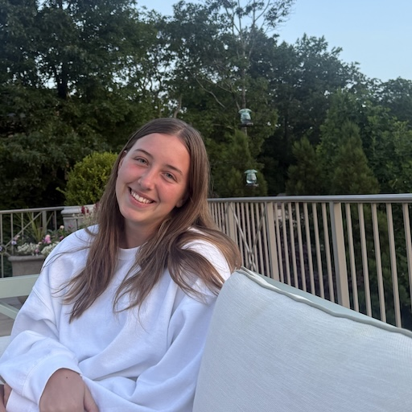

# Lucy Good

{: .profile-photo}

## About

Hey everybody! My name is Lucy Good and I'm a junior from Chattanooga, TN. I'm double-majoring in CS and Philosophy and minoring in Spanish--I actually spent the fall semester abroad in Seville, Spain living with a host family, taking classes in Spanish, and volunteering as an assistant girls volleyball coach!

Last summer, I worked for a tech startup in my hometown where I built them an internal administrative web application for customer management. I owe much of my ability to take on such a project to what I learned in this class last spring! So excited about learning more alongside you all this semester! If you have any questions at all, please feel free to come chat!

## Projects & Links

-   [GitHub](https://github.com/lucykgood){:target="_blank"}
-   [LinkedIn](https://www.linkedin.com/in/lucy-good27/){:target="_blank"}

