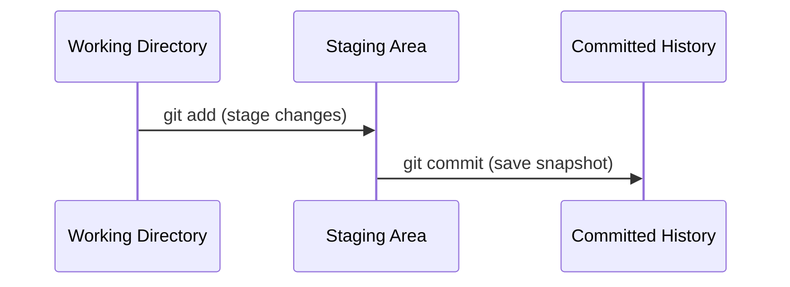

# Ch. 1 Core Concepts of a `git` Repository

`git` becomes much easier to learn and operate with a high-level understanding of its organization and data structure design.

## Snapshots, Not Diffs

`git` doesn’t store the history of differences (diffs) between versions. Instead, it captures a history of snapshots of your project. Each snapshot is like a photograph of your entire project's contents at the moment you decide to *commit* to the snapshot.

The technical design decisions behind `git`'s data structures are brilliant. We'll learn more about them in time. For now, let's just appreciate the features its design enables:

- **Local History**: Your entire project history is stored locally on your machine. This means you can explore or revert changes without needing an internet connection or accessing a central server.
- **Quick Navigation**: Since snapshots contain the full project state, Git can near instantly move to any commit without recalculating the state from diffs.
- **Efficient Storage**: Git only stores files that change between snapshots. Identical files are saved just once and linked back to in later snapshots, which saves space while maintaining integrity.
- **Efficient Comparisons**: Git uses hashing to compare files and directories. This allows it to quickly identify changes without scanning the entire file contents.

## What is a Commit?

Building on the concept of snapshots and data integrity, a **commit** is a saved snapshot of your project at a specific point in time. It contains:

1. **File Contents**: The exact state of the files that were committed.
2. **Metadata**:
    - Who made the commit (name and email).
    - When the commit was made (timestamp).
    - A message describing the changes.
3. **Parent Pointer(s)**: Each commit records a reference to one or more parent commits. Most commits have a single parent, but merge commits can have multiple parents.
4. **Commit ID Hash**: Every commit is assigned a unique cryptographic hash, which acts as its identity. This hash is generated based on the commit’s contents, metadata, and parent pointers. It ensures the integrity of the commit, making it impossible to alter the commit without detection. If even a single byte changes, the hash changes too, signaling that the commit has been tampered with. This immutability is central to Git's reliability.

Here’s an example of what a commit’s metadata might look like:

```bash
commit 5d41402abc4b2a76b9719d911017c592
Parent: e38ad214bd57c8c7f69a1d8f6326b3d1f3e6a2ef
Author: Your Name <your.email@example.com>
Date:   Tue Jan 1 12:00:00 2025 +0000

    Add README file
```

The hash (`5d41402abc4b2a76b9719d911017c592`) uniquely identifies the commit and protects its contents from tampering.

## Commit History

A repository is essentially a timeline of snapshots, with each commit representing a specific state of the project. These snapshots are linked together because each commit holds a reference to its "parent" commit's hash ID, forming a chain. 

In a linear history, this structure is equivalent to a singly linked list. However, as you start working with other team members or experimenting with your own ideas in branches, histories begin to diverge. A diverging history occurs when more than one commit shares the same parent. Merge commits, on the other hand, have multiple parents when branches are combined.

These relationships create a **directed acyclic graph (DAG)**—a concept you’ve seen in COMP210: Data Structures. Here, the DAG ensures that commits are immutable and history is consistent and reliable. Since commits can only reference existing ones and cannot be altered, your entire history remains tamper-proof.

### Navigating and Understanding History

- **The Commit Log**: Think of the commit log as a journal of everything that has happened in your project. Commands like `git log` let you view this history, showing each commit’s hash, author, date, and message.
- **Revisiting Changes**: Each commit is like a bookmark in your project. You can move back and forth in history, inspecting past states or even restoring them.
- **Collaboration Made Easy**: Since every commit includes a message and is linked to its parent, your teammates can see not just what changed but why. This transparency makes it easier to review and integrate work.

## The Working Areas of a `git` Repository

In addition to the committed history, a `git` repository organizes files and changes into two additional areas where you will spend most of your time:

1. **Working Directory**: This is where you directly interact with your project's files. It reflects your local version of the project, where you edit, create, and delete files.
2. **Staging Area**: Also called the index, this is a middle ground where you prepare changes from your working directory before committing them to the repository’s history. Think of it as framing your next snapshot, letting you carefully curate and organize the changes you want to commit to your project’s history. 

### Flow Between Conceptual Areas

Here’s a high-level view of how files move through these areas during a typical workflow:



This flow illustrates how the work you do in your version makes its way into your project's local history. You start by editing files in the **Working Directory**, select specific changes to stage in the **Staging Area**, and then finalize those changes into the **Committed History** with a commit.

In the next chapter, you will learn all the fundamental `git` operations necessary to start a new `git` repository, perform some work, and form a commit history.

