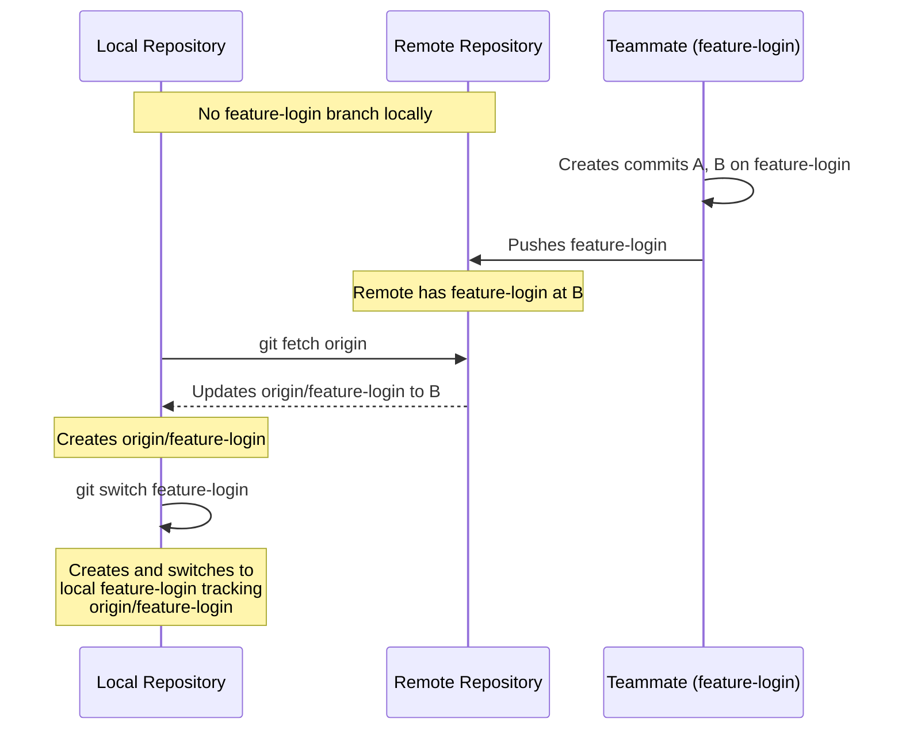
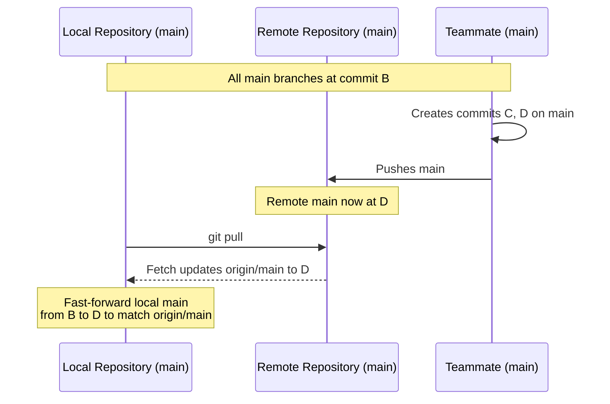
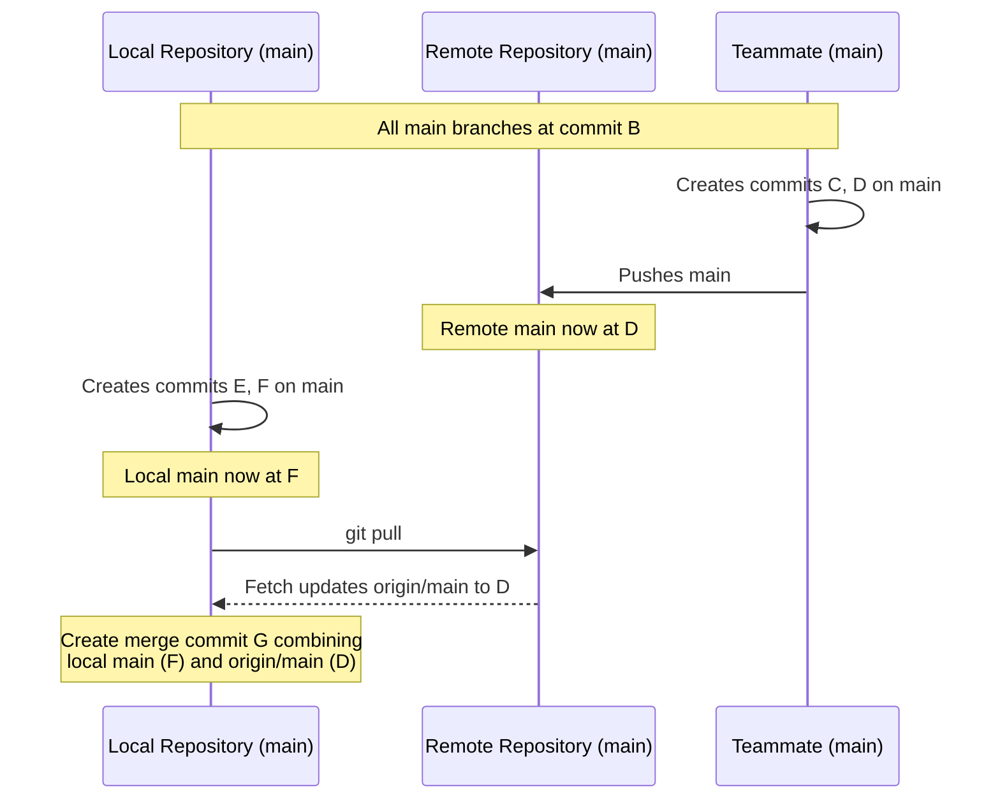
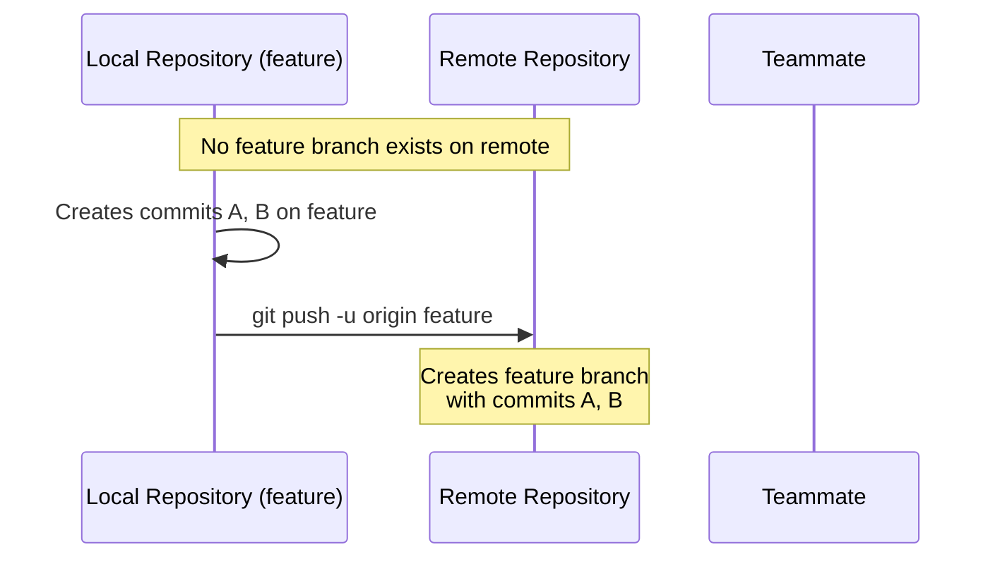
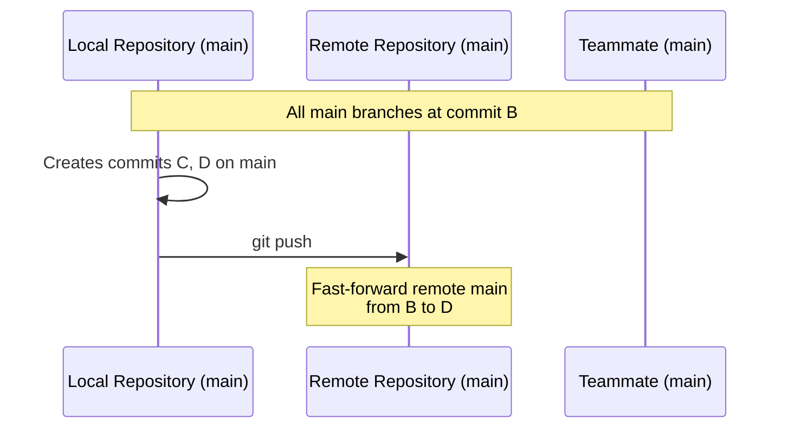
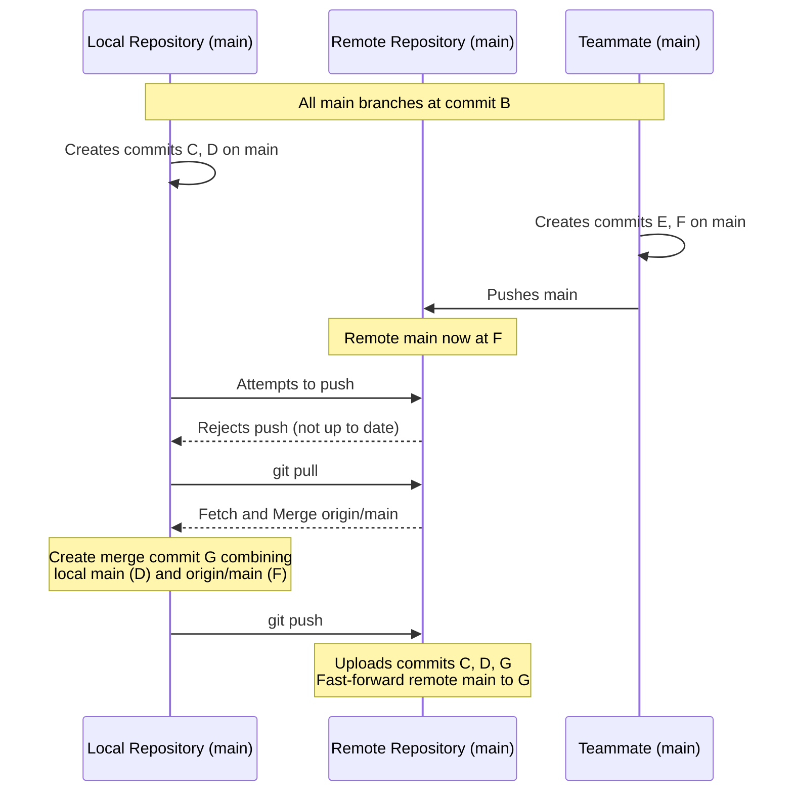

# Ch. 4 Git Collaboration: Working with Remote Repositories

In today's software development world, writing code is rarely a solo endeavor. Whether you're contributing to open source projects, working on a team assignment, or collaborating with others across the globe, you'll need to share your code and coordinate with other developers. This is where Git's collaboration features become essential - they're the foundation of modern software development practices.

This tutorial will help you master the core concepts and commands needed for effective collaboration using Git. By the end, you will:

- Understand how Git connects and synchronizes with other repositories
- Be able to share your code with teammates and pull in their latest changes
- Know how to handle common collaboration scenarios and resolve conflicts
- Be ready to participate effectively in team projects

## Understanding Remotes: Your Gateway to Collaboration

Think of your local Git repository as your personal workspace - it's where you write code, make commits, and track changes. But how do you share these changes with your teammates? That's where remote repositories come in. A remote repository acts like a shared storage space that everyone on your team can access. It's similar to how cloud storage lets multiple people share and sync files, but with special features designed for code collaboration.

!!! info "What's a Remote Repository?"
    A remote repository is a version of your project hosted on the internet or a network. It serves as the central reference point that all team members use to share and synchronize their work. Common hosting platforms include GitHub, GitLab, and Bitbucket.

Let's start by connecting to a remote repository. We'll use GitHub as our example, but these concepts work the same way with any Git hosting service:

```bash
git remote add origin https://github.com/username/project.git # (1)!
```

1. Create a new connection named "origin" pointing to your GitHub repository

We're using "origin" as the name for our remote repository here. While you can choose any name you like, "origin" is the conventional choice for your primary remote repository - think of it as the source of truth for your project.

You can manage your remote connections with these helpful commands:

```bash
git remote --verbose # (1)!
git remote show origin # (2)!
```

1. List all remote repositories with their URLs
2. Display detailed information about the "origin" remote

!!! note "Command Shorthand"
    You can use `git remote -v` as a shorter version of the verbose flag.

### HTTPS vs SSH Remote URLs

When adding a remote, you have two main options for how to connect: HTTPS or SSH.

```bash
# HTTPS style remote
git remote add origin https://github.com/username/repository.git

# SSH style remote
git remote add origin git@github.com:username/repository.git
```

HTTPS (Hypertext Transfer Protocol Secure) is the protocol that powers secure websites and is GitHub's recommended approach for repository connections. SSH (Secure Shell) is a protocol designed for secure remote access to systems.

Both protocols can be set up to remember your credentials, so you won't need to enter them each time you interact with GitHub. With HTTPS, this means configuring a credential manager to store your personal access token. With SSH, you'll set up a key pair that allows for automatic authentication.

For most developers, HTTPS is the better choice. It works reliably across different networks and firewall configurations, and GitHub's tooling is optimized for HTTPS connections. Consider SSH as an alternative only if you have specific requirements that HTTPS doesn't meet, or if you're already comfortable managing SSH keys.

!!! note "Authentication Deep Dive"
    GitHub provides comprehensive documentation about authentication methods, security best practices, and troubleshooting tips in their [authentication guide](https://docs.github.com/en/authentication/keeping-your-account-and-data-secure/about-authentication-to-github#authenticating-with-the-command-line). You'll find detailed instructions for setting up both HTTPS and SSH authentication, including how to create and manage access tokens, configure SSH keys, and use two-factor authentication for additional security.

## Fetching: Preview Changes Before Merging

Before you integrate changes from your teammates, it's often helpful to see what they've done first. That's where fetching comes in - it lets you download and inspect changes without immediately applying them to your work. Think of it like previewing changes in a Google Doc before accepting them.

```bash
git fetch --all # (1)!
```

1. Download all branches and commits from every configured remote

!!! note "Command Shorthand"
    The shorter version is `git fetch -a` once you're comfortable with the operation.

When you fetch, Git downloads all new commits but doesn't modify your working files or local branches. This is particularly useful when you want to:

- Review your teammates' changes before incorporating them
- Check if there are any potential conflicts with your work
- Work with multiple feature branches from different team members

For example, if your teammate pushed changes to a branch named `feature-login`, here's how you can examine their work:

```bash
git fetch origin # (1)!
git switch feature-login # (2)!
```

1. Download the latest changes from the remote repository
2. Create and switch to a local branch tracking the remote feature-login branch

Let's look at how this works using a sequence diagram. In sequence diagrams, you see a timeline of how operations unfold between different participants (in our case, different repositories). Each vertical line represents a different participant, and each entry on that line happens in sequence over time as you read from top to bottom. These diagrams are a common tool in software engineering for understanding how different parts of a system interact.



After the `switch` command, you are now working in a local branch named `feature-login` which tracks `origin/feature-login`. Since it's just a branch, if you think your teammate's work looks good and you'd like to merge it into your project, you can switch back to whatever branch you'd like and, just like any other branch, merge it in!

### Understanding Remote Branches

Git uses a special naming system to keep track of branches that exist in remote repositories. Remote branches are prefixed with "remotes/origin/" to distinguish them from your local branches. You can see all remote branches using:

```bash
git branch --remotes # (1)!
```

1. Display all remote branches known to your local repository

The output might look something like this:

```
  remotes/origin/main
  remotes/origin/feature-login
  remotes/origin/bugfix-header
  remotes/origin/documentation
  remotes/origin/HEAD -> origin/main
```

!!! tip "Remote References"
    Remote branch names can be used in any Git command that accepts a branch name. For example: `git diff main origin/main` shows differences between your local and remote main branches.

## Pulling: Combining Fetch and Merge

1. Switch to your main branch
2. Download and integrate the latest changes from the remote main branch

!!! warning "Check Your Branch"
    Always verify which branch you're on before pulling. Pulling while on the wrong branch means you'll merge remote changes into the wrong place in your repository.

### Pulling When Remote Branches Haven't Diverged

If you haven't made any new commits since your last synchronization with the remote repository, pulling performs a fast-forward merge, just like you've seen before when merging branches. The remote branch `origin/main` is treated exactly like any other branch that has new commits – Git simply moves your branch pointer forward to match it.



### Pulling When Remote Branches Have Diverged

If you've made local commits while others have pushed to the remote, your branch and `origin/main` have diverged – a situation you're familiar with from merging branches. Just as before, Git needs to create a merge commit to combine these parallel lines of development.

Here's the corresponding sequence diagram:



You might need to resolve conflicts here, just as you would when merging any other diverged branches. Remember that `origin/main` is just Git's way of tracking what's on the remote repository – once you have fetched a remote branch, _it's just a local branch with a different naming convention_ and, as such, it behaves _exactly_ like any other branch when it comes to merging.

## Cloning: Starting with an Existing Project

You've likely started many projects by cloning an existing repository. Now that you understand how Git manages remote repositories, let's explore what actually happens during the cloning process. Cloning is essentially an automated combination of several operations you've just learned about, packaged into a single command for convenience.

When you run `git clone`, Git performs these steps in sequence:

1. Creates a new directory for your project
2. Initializes a fresh Git repository inside it
3. Adds a remote named "origin" pointing to the URL you're cloning from
4. Fetches all branches and history from that remote
5. Sets up tracking relationships between local and remote branches
6. Checks out the default branch (usually `main`) as your working copy

Let's see this in action:

```bash
git clone https://github.com/username/project.git # (1)!
```

1. Download the repository and set up a local copy with remote tracking

This single command accomplishes what would otherwise require several manual steps:

```bash
mkdir project
cd project
git init
git remote add origin https://github.com/username/project.git
git fetch origin
git switch main
```

## Pushing: Sharing Your Work

Now that you understand how to get changes from your teammates through pulling, let's look at how to share your work with them through pushing. When you push your commits, you're asking the remote repository to integrate your changes into its history.

### Setting Up Branch Tracking

When you're working on a completely new feature or bug fix, you'll often start by creating a local branch. Until you share this branch with others, it exists only in your local repository – the remote repository doesn't know anything about it yet. In these cases, when you push the branch for the first time, you need to tell Git two things:

1. Which remote repository should store this branch (usually "origin")
2. What name the branch should have on the remote (usually the same as your local branch name)

This is what the `--set-upstream` flag (or `-u` for short) does in the following command:

```bash
git push --set-upstream origin feature-awesome # (1)!
```

1. Upload your new branch and configure it to track a branch of the same name on the remote

This command creates a connection, or "tracking relationship," between your local `feature-awesome` branch and a new branch of the same name on the remote repository. This tracking relationship is important – once established, it lets you use simple `git push` and `git pull` commands without having to specify the remote and branch names each time.

!!! note "Local vs Remote Branches"
    This is different from when you `fetch` and `switch` to a branch that your teammate has already shared. In that case, Git automatically sets up the tracking relationship for you because it knows the branch came from the remote repository. As such, you can push new commits to the teammate's branch without needing to use `--set-upstream` the first time.

### Creating New Remote Branches

When you push a branch that doesn't exist on the remote repository yet, Git will create it for you.



You'll encounter this scenario frequently when starting new work. For example, when you create a new feature branch locally and want to share it with your team, or when you're starting a new bug fix and want to get early feedback.

### Pushing to Existing Branches

When pushing to a branch that already exists on the remote, Git checks if your changes can be merged cleanly thanks to a linear commit history. If no one has pushed new changes to the remote branch since you last pulled, Git can perform a fast-forward merge on the remote repository – just like the fast-forward merges you're familiar with locally. Your commits are simply added to the end of the remote branch's history:



### Handling Push Rejections

Sometimes your push will be rejected because the remote branch has new commits that you don't have locally. This is Git's way of preventing you from accidentally overwriting your teammates' work. When this happens, you need to merge their changes in to your local repository's branch before you can push yours:



This sequence should look familiar – it's the same divergent history situation you saw with pulling, just in reverse. Here's what's happening:

1. The remote rejects your push because accepting it would lose your teammate's work
2. You pull to get your teammate's changes, creating a merge commit
3. Now your history contains everything from the remote, so your push can be accepted

Remember that after the pull creates a merge commit, your subsequent push will be accepted because it's effectively a fast-forward merge from the remote's perspective – all the commits it has are already part of your history.

## Best Practices for Working with Remote Repositories

Let's discuss some essential habits that will help you collaborate effectively with your team when working with remote repositories.

### Fetch Early and Often

Make a habit of frequently fetching from your remote repository, just as you regularly save your work. Fetching is safe – it won't modify your working directory or local branches – and it helps you stay aware of what your teammates are doing. Many developers start their day by fetching the latest changes and do so again before starting any significant new work. This practice helps them spot potential conflicts early and stay synchronized with their team.

### Pull Before You Push

Always pull before pushing to a shared branch, even if you think your local branch is up to date. This habit ensures you're working with the latest code and helps prevent push rejections. When working on long-running feature branches, it's also good practice to regularly pull from the main branch to keep your feature branch up to date. This prevents your branch from diverging too far from the main line of development.

### Communicate Branch Intent

When pushing a new branch to the remote repository, use clear, descriptive names that communicate the branch's purpose. A good branch name tells your teammates what work is being done without them having to examine the code. Many teams use prefixes to categorize the type of work and include ticket numbers for tracking:

```
feature-user-authentication
feature-issue-123-email-notifications
bugfix-login-timeout
bugfix-456-memory-leak
wip-oauth-integration
```

These descriptive names help your team understand at a glance what changes to expect when reviewing your code.

### Handle Conflicts Promptly

If you encounter conflicts during a pull, address them right away while the changes are fresh in your mind. The longer you wait, the harder it becomes to remember the context of the changes and make good decisions about how to resolve the conflicts.

### Push Thoughtfully

While it's important to share your work regularly, avoid pushing broken or incomplete code to shared branches. Before pushing, make sure your changes compile, pass tests, and include any new files your changes depend on. This is especially important for branches that others actively use, like the main branch.

## Summary and Key Points

Working with remote repositories in Git is all about effective collaboration. Remember:

- Remote repositories are shared spaces for code collaboration
- Fetch lets you preview changes before integrating them
- Pull combines fetching and merging in one step
- Push shares your work with the team

### Essential Commands Reference

```bash
git remote add <name> <url>    # (1)!
git fetch -a                   # (2)!
git switch <branch>            # (3)!
git pull                       # (4)!
git push -u origin <branch>    # (5)!
```

1. Connect to a remote repository
2. Download all remote changes
3. Switch to or create a branch
4. Download and integrate remote changes
5. Upload your changes and set tracking

!!! tip "Further Reading"
    - [Git Remote Documentation](https://git-scm.com/docs/git-remote)
    - [GitHub Authentication Guide](https://docs.github.com/en/authentication)
    - [Pro Git Book: Working with Remotes](https://git-scm.com/book/en/v2/Git-Basics-Working-with-Remotes)